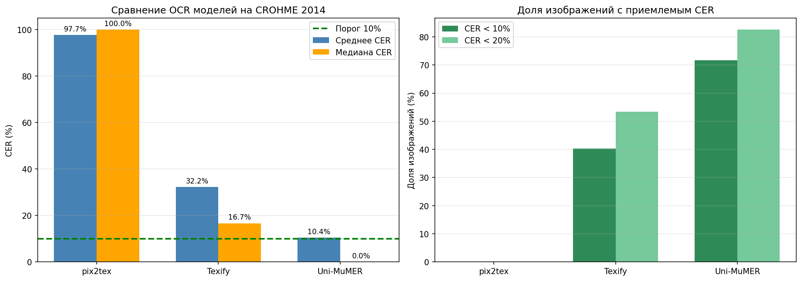

# OCR-бенчмарк: сравнение моделей рукописной математики

## Цель

Цель эксперимента - выбрать OCR-модель для пайплайна ЕГЭ-чекера, который
получает фотографию рукописного математического решения и переводит ее в
структурированную LaTeX-запись для дальнейшей проверки LLM.

Основной критерий качества - CER (Character Error Rate) после нормализации
LaTeX. Чем ниже CER, тем ближе распознанная формула к эталонной разметке.
Целевой ориентир для основной OCR-модели - средний CER около 10% или ниже.

## Датасет и очистка

Для сравнения использовался датасет **CROHME 2014 test**:

- исходный размер: 986 изображений;
- удалено: 34 структурно поврежденных сэмпла;
- итоговый размер после очистки: 952 изображения.

Из очистки были исключены сэмплы с пустыми изображениями, артефактами
рендеринга или структурными повреждениями, которые мешают честно сравнивать
качество OCR-моделей.

## Сравниваемые модели

| Модель | Размер | Средний CER | Медиана CER | CER < 10% | CER < 20% | Точное совпадение |
|---|---:|---:|---:|---:|---:|---:|
| pix2tex | 13M | 97.7% | 100.0% | 0.0% | 0.1% | 0.0% |
| Texify | 625M | 32.2% | 16.7% | 40.3% | 53.4% | 28.7% |
| Uni-MuMER | 4.4B | 10.4% | 0.0% | 71.6% | 82.6% | 54.8% |

## Интерпретация результатов

**pix2tex** показала неудовлетворительное качество на выбранном датасете:
средний CER составляет 97.7%, медианный CER равен 100%, а доля примеров с
CER < 10% равна 0%. Это означает, что модель практически не подходит для
текущего пайплайна рукописной математики.

**Texify** заметно лучше pix2tex: средний CER снизился до 32.2%, медианный CER
составил 16.7%, а 40.3% изображений были распознаны с CER < 10%. Тем не менее
ошибка остается слишком высокой для роли основной OCR-модели, потому что почти
половина примеров все еще требует значимой коррекции.

**Uni-MuMER-Qwen3-VL-4B** показала лучший результат: средний CER равен 10.4%,
медианный CER равен 0%, а 71.6% изображений имеют CER < 10%. Кроме того, для
54.8% изображений результат после нормализации полностью совпал с эталоном.
Это говорит о том, что на типичном входе модель часто распознает формулу без
существенных ошибок.

## Анализ ошибок Uni-MuMER

Несмотря на сильный средний результат, у Uni-MuMER остается хвост сложных
примеров:

- 166 изображений из 952 имеют CER >= 20%;
- 57 изображений имеют CER >= 50%;
- 15 изображений имеют CER = 100%.

Основные проблемные случаи связаны со сложной структурой формул, неоднозначной
рукописной записью, длинными выражениями и ошибками в отдельных символах или
индексах. Для финального продукта это означает, что OCR нельзя считать
абсолютно надежным компонентом: даже лучшая модель должна работать вместе с
механизмом fallback.

Примеры лучших и худших распознаваний:

- [pix2tex: лучшие и худшие примеры](pix2tex_best_worst.png)
- [Texify: лучшие и худшие примеры](Texify_best_worst.png)
- [Uni-MuMER: лучшие и худшие примеры](Uni-MuMER_best_worst.png)

## Вывод

В качестве основной OCR-модели для пайплайна выбрана
**Uni-MuMER-Qwen3-VL-4B**.

Она практически достигает целевого порога среднего CER в 10%, показывает
нулевую медианную ошибку и дает CER < 10% для 71.6% изображений. Это делает ее
лучшим кандидатом для автоматического распознавания рукописной математики в
ЕГЭ-чекере.

При этом оставшийся хвост сложных случаев требует fallback-механизма в
финальном пайплайне. Для таких случаев можно использовать повторный запрос
фотографии, ручную LLM-верификацию LaTeX-результата или дополнительную проверку
сомнительных фрагментов перед оцениванием решения.

